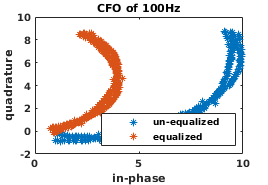

## Introduction
This project implements a MATLAB-based RFID passive receiver. The code extends from the GNURadio implementation in [2]. Mainly, the reader takes pre-recorded IQ samples from an RFID reader-tag interaction, and decodes them in a passive manner. The code in this repository has been tested with the sample dataset and other executions using the USRP Software Defined Radios (SDR) and the GNURadio flowgraph in [2].

## Project hierarchy

The project is structured as follows:

1. **ROOT**: Contains the main sctipts and functions to execute the RFID receiver. The main script is *main_RX_RFID.m*.
2. **misc**: The raw IQ samples that are taken as inputs for the Matlab receiver are stored in this location by default.
3. **utils**: Hosts multiple extra functions used throughout the execution.
4. **Old**: Old version of the scripts.
5. **figs**: Where results are stored.

## Installation

The code uses advanced functions to assess the period and peaks of an input signal. In particular, the code uses the peak finder package from the following website:
https://terpconnect.umd.edu/~toh/spectrum/PeakFindingandMeasurement.htm

To download the code, please run the script below. If the installation fails, please install it manually from the website. The script installs the source code under the folder *utils/*.

```Bash
./install_peakFinder.sh
```

The input IQ samples can either be generated using SDR or be downloaded from the dataset in [2]. To download and configure a sample dataset, please run the script below. The script creates the directories *misc/data* and stores the sample dataset *file_test_source*.

```Bash
./conf_dataset.sh
```

**Software Requirements**: *For the correct execution of the code, ensure you are running it on version R2019a or later.*

### RFID basics

RFID Gen2 communication involves passive (i.e., battery-free) tags and an active reader device. The reader energizes the tags and sends commands to them. After harvesting enough energy, tags wake up to listen for the reader commands and react to them, e.g., by sending a response. In the so-called inventory mode, each tag responds with its unique ID called Electronic Product Code (EPC). 

A simple inventory session has four phases orchestrated by a Slotted Aloha protocol: 1) Query: the reader broadcasts a query and indicates the number of available slots, 2) RN16: if a tag decodes the query, it chooses a random slot and later responds with a 16-bit random sequence (called RN16) using FM0 modulation in the selected slot, 3) ACK: in each slot, if the reader decodes an RN16, it sends an acknowledgment (ACK) containing the same decoded RN16, and 4) EPC: each tag decoding the ACK matches the included RN16 to the RN16 it chose earlier, and replies with its EPC when there is a match. Since tags randomly choose slots to reply, a slot may have zero, one or more RN16s that collide at the reader. In contrast, since it is unlikely that tags generate the same RN16, EPC responses do not usually collide. RN16s do not have built-in error detection, making it difficult for the reader to know whether an RN16 was decoded correctly or not [2].

A sample Reader-tag interaction is captured in the Figure below, where frames are configured with only one slot and only one tag is present in the range.

<p align="middle">

</p>

### Run RFID receiver

The main script is *main_RX_RFID*. It first loads the input raw IQ samples and the configuration of the decoder. The decoder follows the implementation in [2,3] and consists mainly of 3 blocks:

1. **Match Filter**: It filters the signal using a constant pulse of 25 samples length and a decimation factor of 5. This averages the noise and increases the probability of decoding the tag's response.
2. **Gate**: This block keeps track of the DC offset and assesses whether a tag response is present. Upon detecting a response, it forwards the sample to the tag decoder.
3. **Tag decoder**: This block contians the core code of the decoder. First, it performs fine synchronization using the preamble. Second, it estimates the wireless channel and equalizes the symbol. Lastly, it decodes the bits and even assertains its truthfulness via CRC checking (in case of EPC, not RN16).

Note that these blocks and the general execution if configured according to the GNURadio implementation in [2]. The goal is to use the GNURadio code to generate new traces that can be imported later on into the MATLAB-based receiver. In the event that new traces are generated with a different configuration, the changes should be updated in the configuration functio *fconfig*.

The script *main_RX_RFID* accepts multiple inputs, all of them are optional. Below are is an example where we indicate the location of the IQ samples, activate the LOGS and add no impairment:

```Matlab
% Loads the IQ samples from a specific location and activates the LOGS. 
% The code prints the decoded EPC as well as some metrics of BER and EVM 
% (useful when the EPC is known a priori)
main_RX_RFID('fileName', 'misc/data/file_source_test', 'LOGS', true)
```

Carrier Frequency Offset (CFO) and other impairments hinder the decoding of information comings from RFID tags. In particular, the CFO generates a symbol rotation as shown in the pictures below. The code can also generate spurious sinewave signals. For more information, see the docs of the main function. For instance, the following inputs generate a CFO of 350Hz to the input samples:

```Matlab
main_RX_RFID('fo', 350)  % Generates an offset of 350Hz
```

Some examples of decoded symbols under suffering CFO are shown below.

<p align="middle">



</p>

A sample of the execution output is shown below, which maps to the sample dataset in [2] with no other impairment added. The left-most integer denotes the slot index within the execution. For each slot, the code prints the following information- The first value is the RN16 value that was decoded in the second stage of the inventory round. The second value is the channel estimation (gain and phase). Then, a short and a complete EPC decoded is shown for that particular slot. Note that the decoder only accepts those EPC's who has passed the CRC check. Lastly, a BER measurement is included. This last feature is only relevant when only one tag is in range and its EPC is known a priori.

```Source
 SLOT  ||                  MESSAGE 
       ...
    65 || RN16: 1  1  0  0  0  1  0  1  1  0  1  1  0  1  0  1
       || H_est: 0.180 (-0.194)
       || EPC_hex (short): 27
       || EPC_hex (full): DDD9 0140 0000 0027
       || BER of 0.0000
    66 || RN16: 1  0  1  1  1  0  0  1  0  1  0  0  1  1  0  0
       || H_est: 0.186 (-0.063)
       || EPC_hex (short): 27
       || EPC_hex (full): DDD9 0140 0000 0027
       || BER of 0.0000
    67 || RN16: 0  1  1  0  1  1  0  1  0  1  1  1  1  0  0  0
       || H_est: 0.198 (-0.135)
       || EPC_hex (short): 27
       || EPC_hex (full): DDD9 0140 0000 0027
       || BER of 0.0000
```

## CFO Compensation

This respository also contains testings scripts that attempt to estimate and correct the CFO of an inputted signal using signal fitting. The CFO translates into a spurious modulation factor in the time domain that ressembles a periodic sinewave.

The script *test_CFOEst_theory* generates a constant waveform and applies a CFO to it. Then, it attempts to estimate it using *N* number of samples. The script returns the estimation error in Hz. One can also select the measured SNR (in dB) at the receiver

```Matlab
test_CFOEst_theory('fo', 120, 'SNR', 15)  % Generates 120Hz of CFO under 15dB of SNR
```

Factors such as the *SNR* and the number of samples (*N*) have an impact on the estimation accuracy of the CFO. The figures below serve as an example of how accurate this method can be. On the downside, the applicability of this method is restricted for slowly changing CFO over time, as fitting also takes time to compute.

<p align="middle">


</p>

## Contact

For more information about the code, please don't hesitate to contact me by email. I'll be happy to assist you and answer any question you may have.

Carlos Bocanegra Guerra  
PhD Candidate  
Electrical and Computer Engineering (EECE)  
Northeastern University  
bocanegrac@coe.neu.edu

## Cite

If you decide to use this code, please cite our work in [1]. Note that this project does not contain the full code of [1].

## References

[1] Carlos Bocanegra, Mohammad A. (Amir) Khojastepour, Mustafa Y. Arslan, Eugene Chai, Sampath Rangarajan, and Kaushik R. Chowdhury. 2020. RFGo: a seamless self-checkout system for apparel stores using RFID. In Proceedings of the 26th Annual International Conference on Mobile Computing and Networking (MobiCom '20). Association for Computing Machinery, New York, NY, USA, Article 54, 1–14. DOI:https://doi.org/10.1145/3372224.3419211

[2] Nikos Kargas, Fanis Mavromatis, and Aggelos Bletsas. 2015. Fully-Coherent reader with commodity SDR for Gen2 FM0 and computational RFID. IEEE Wireless Communications Letters 4, 6 (2015), 617–620. https://doi.org/10.1109/
LWC.2015.2475749
https://github.com/nkargas/Gen2-UHF-RFID-Reader